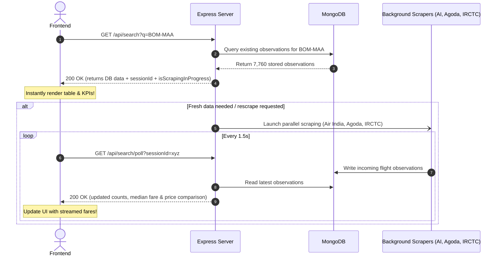

# India Airfare Intelligence & CPI Augmentation API
## Frontend Integration Specification & Complete API Reference

> **Base URL:** `http://localhost:5000`  
> **API Mount Path:** `/api`  
> **Content-Type:** `application/json`  
> **CORS Policy:** Permissive for `http://localhost:*` and configured `FRONTEND_URL` (default: `http://localhost:3000`), `credentials: true`.  
> **Active Providers:** **Air India**, **Agoda**, **IRCTC Air**  
> **Interactive Tester:** [http://localhost:5000/api-tester](http://localhost:5000/api-tester)  

---

## Table of Contents

1. [Standard Response Envelope](#1-standard-response-envelope)
2. [Quick Route Directory](#2-quick-route-directory)
3. [Search & Progressive Background Scraping (Primary Frontend Endpoint)](#3-search--progressive-background-scraping)
   - [GET /api/search](#get-apisearch)
   - [GET /api/search/poll](#get-apisearchpoll)
   - [GET /api/search/session/:id](#get-apisearchsessionid)
4. [Route Intelligence Endpoints](#4-route-intelligence-endpoints)
   - [GET /api/routes](#get-apiroutes)
   - [GET /api/routes/:route](#get-apiroutesroute)
   - [GET /api/routes/:route/history](#get-apiroutesroutehistory)
5. [Airfare Index & Master Overview Endpoints](#5-airfare-index--master-overview-endpoints)
   - [GET /api/index](#get-apiindex)
   - [GET /api/index/history](#get-apiindexhistory)
   - [GET /api/dashboard](#get-apidashboard)
6. [CPI Augmentation & Macro-Inflation Endpoints](#6-cpi-augmentation--macro-inflation-endpoints)
   - [GET /api/cpi (or /api/cpi/summary)](#get-apicpi-or-get-apicpisummary)
   - [GET /api/cpi/comparison](#get-apicpicomparison)
   - [GET /api/cpi/decomposition (or /api/cpi/routes)](#get-apicpidecomposition-or-get-apicpiroutes)
   - [GET /api/cpi/simulate](#get-apicpisimulate)
7. [System, Scraper & Data Pipeline Endpoints](#7-system-scraper--data-pipeline-endpoints)
   - [GET /api/health](#get-apihealth)
   - [POST /api/refresh](#post-apirefresh)
   - [GET /api/scraper/status](#get-apiscraperstatus)
   - [GET /api/scraper/jobs](#get-apiscraperjobs)
   - [GET /api/data/status](#get-apidatastatus)
   - [GET /api/data/quality](#get-apidataquality)
8. [Complete TypeScript Type Definitions](#8-complete-typescript-type-definitions)
9. [Frontend React Hooks & Axios Integration Examples](#9-frontend-react-hooks--axios-integration-examples)

---

## 1. Standard Response Envelope

All API endpoints return JSON conforming to consistent envelopes.

### Success Response Envelope
```json
{
  "success": true,
  "data": { ... }
}
```

### Error Response Envelope
```json
{
  "success": false,
  "error": {
    "code": "ERROR_IDENTIFIER_CODE",
    "message": "Human-readable explanation of the error."
  }
}
```

### Common HTTP Status Codes
| HTTP Status | Meaning | Typical Error Code |
| :--- | :--- | :--- |
| `200 OK` | Request succeeded | N/A |
| `201 Created` | New resource created (e.g. ScrapeJob) | N/A |
| `400 Bad Request` | Invalid query or body parameters | `INVALID_JOB_PARAMS` |
| `404 Not Found` | Route or resource not found | `ROUTE_NOT_FOUND`, `ROUTE_HISTORY_NOT_AVAILABLE`, `SESSION_NOT_FOUND` |
| `500 Internal Server Error` | Server computation or DB error | `INTERNAL_SERVER_ERROR`, `SEARCH_FAILED`, `REFRESH_FAILED` |
| `503 Service Unavailable` | Operation requires MongoDB but DB is disconnected | `DB_DISCONNECTED` |

---

## 2. Quick Route Directory

| # | Method | Endpoint | Category | Description |
|---|:---|:---|:---|:---|
| 1 | `GET` | `/api/search` | Search | **Instant database-first search** + starts background scrape |
| 2 | `GET` | `/api/search/poll` | Search | **Progressive polling** for live streaming flight observations |
| 3 | `GET` | `/api/search/session/:id`| Search | Fetch status and progress of an active background scrape |
| 4 | `GET` | `/api/routes` | Routes | List all tracked corridors with volume weights & sorting |
| 5 | `GET` | `/api/routes/:route` | Routes | Detailed route inspection, 3-way price comparison & observations |
| 6 | `GET` | `/api/routes/:route/history`| Routes | Historical spot fare points for line charts |
| 7 | `GET` | `/api/index` | Index | Headline composite India Airfare Index value (Base 100) |
| 8 | `GET` | `/api/index/history` | Index | Historical time-series points of the national index |
| 9 | `GET` | `/api/dashboard` | Dashboard | Main aggregated dashboard overview payload |
| 10 | `GET` | `/api/cpi/summary` | CPI | Macro-inflation nowcast summary & CPI weights |
| 11 | `GET` | `/api/cpi/comparison`| CPI | Airfare Index vs Headline MOSPI CPI time-series |
| 12 | `GET` | `/api/cpi/decomposition`| CPI | Route-level contribution to Headline & Transport CPI |
| 13 | `GET` | `/api/cpi/simulate` | CPI | Elasticity simulation (e.g. `?shock=10`) |
| 14 | `GET` | `/api/health` | System | Healthcheck and MongoDB connection status |
| 15 | `POST` | `/api/refresh` | System | Recalculates master index and invalidates cache |
| 16 | `GET` | `/api/scraper/status` | Scraper | Runtime status of background scraper workers |
| 17 | `GET` | `/api/scraper/jobs` | Scraper | Active and scheduled scraping targets |
| 18 | `GET` | `/api/data/status` | Data | Pipeline status, collection record counts |
| 19 | `GET` | `/api/data/quality` | Data | Data quality metrics, audits and warnings |

---

## 3. Search & Progressive Background Scraping

The search architecture provides **instant responses (<100ms)** from MongoDB while running multi-provider scraping (**Air India**, **Agoda**, and **IRCTC Air**) in the background.



---

### `GET /api/search`
Instant Database-First flight search with progressive background scraper integration.

- **Query Parameters:**

| Parameter | Type | Required | Default | Description / Example |
| :--- | :--- | :--- | :--- | :--- |
| `q` or `query` | `string` | Conditional* | `""` | Query text: `"DEL-BOM"`, `"Mumbai to Chennai"`, `"BOM MAA"`, `"Agoda DEL BLR"`, `"IRCTC BOM DEL"` |
| `origin` | `string` | Conditional* | `""` | Direct 3-letter IATA code (e.g. `"BOM"`) |
| `destination` | `string` | Conditional* | `""` | Direct 3-letter IATA code (e.g. `"MAA"`) |
| `departureDate`| `string` | No | Today | Departure date in `YYYY-MM-DD` |
| `days` | `number` | No | `30` | Horizon in days for forward calendar scraping (default: 30) |
| `source` | `string` | No | `"all"` | Provider filter: `"all"`, `"Air India"`, `"Agoda"`, `"IRCTC Air"` |
| `rescrape` | `boolean`| No | `false` | Set to `true` to force trigger fresh background scraper |

*\*Note: Either `q` OR both `origin` and `destination` must be provided.*

#### Success Response (`200 OK`):
```json
{
  "success": true,
  "query": "BOM-MAA",
  "data": {
    "source": "database",
    "scraped": false,
    "isScrapingInProgress": false,
    "sessionId": null,
    "sessionProgress": null,
    "state": "DATABASE_FRESH",
    "route": "BOM-MAA",
    "observationsCount": 7760,
    "latestScrapedAt": "2026-08-31T05:30:00.000Z",
    "priceComparison": {
      "providers": {
        "Agoda": {
          "status": "ok",
          "observationsCount": 1183,
          "minFare": 5647,
          "maxFare": 17421,
          "medianFare": 6652,
          "meanFare": 7333.02
        },
        "Air India": {
          "status": "ok",
          "observationsCount": 1920,
          "minFare": 14690,
          "maxFare": 22043,
          "medianFare": 14690,
          "meanFare": 15078.55
        },
        "IRCTC Air": {
          "status": "ok",
          "observationsCount": 4657,
          "minFare": 6034,
          "maxFare": 158940,
          "medianFare": 9682,
          "meanFare": 11726.02
        }
      },
      "cheapest": "Agoda",
      "spread": {
        "cheapestProvider": "Agoda",
        "expensiveProvider": "Air India",
        "differenceInr": 9043,
        "differencePercent": 61.6
      },
      "comparedAt": "2026-08-31T05:36:10.946Z"
    },
    "routeIndexEngine": {
      "engineStatus": "COMPUTED_VIA_INDEX_ENGINE",
      "methodology": "CPI-Augmented Airfare Index (Laspeyres formula with median representative fare)",
      "route": "BOM-MAA",
      "routeIndex": 153.0367,
      "currentRepresentativeFare": 10180.00,
      "baseRepresentativeFare": 6652.00,
      "baseSource": "HISTORICAL_COLLECTION",
      "isBaselineEstablished": true,
      "weight": 0.084500,
      "contribution": 12.9316,
      "passengerVolume": 1420000,
      "nationalIndex": 118.45,
      "fareStats": {
        "observationsCount": 7760,
        "validObservationsCount": 7760,
        "medianFare": 10180.00,
        "meanFare": 12056.40,
        "minFare": 5647,
        "maxFare": 158940
      }
    },
    "observations": [
      {
        "_id": "66d213456789...",
        "source": "Agoda",
        "airline": "IndiGo",
        "flightNo": "6E-2128",
        "origin": "BOM",
        "destination": "MAA",
        "route": "BOM-MAA",
        "departureDate": "2026-09-05T00:00:00.000Z",
        "departureTime": "07:05",
        "arrivalTime": "08:50",
        "duration": "1h 45m",
        "stops": 0,
        "cabinClass": "Economy",
        "fareType": "Regular",
        "totalFare": 5647,
        "currency": "INR",
        "metadata": {
          "base": 4900,
          "tax": 747
        },
        "scrapedAt": "2026-08-31T05:30:00.000Z"
      }
    ]
  }
}
```

---

### `GET /api/search/poll`
Progressive polling endpoint returning incremental observations, provider status, and engine calculations.

- **Query Parameters:**
  - `sessionId` (`string`, optional): Search session UUID returned by `/api/search`.
  - `q` or `route` (`string`, optional): Route pair (e.g. `"BOM-MAA"`).

#### Success Response (`200 OK`):
```json
{
  "success": true,
  "session": {
    "id": "d4fbab69-717d-4b80-a829-d25759643b34",
    "status": "in_progress",
    "progress": {
      "agoda": {
        "label": "Agoda",
        "status": "completed",
        "observationsCount": 600,
        "completedAt": "2026-08-31T05:40:00.000Z",
        "error": null
      },
      "irctc": {
        "label": "IRCTC Air",
        "status": "scraping",
        "observationsCount": 0,
        "completedAt": null,
        "error": null
      },
      "airindia": {
        "label": "Air India",
        "status": "scraping",
        "observationsCount": 0,
        "completedAt": null,
        "error": null
      }
    },
    "totalNewObservations": 600,
    "completedProvidersCount": 1,
    "totalProvidersCount": 3,
    "isCompleted": false
  },
  "data": {
    "route": "BOM-MAA",
    "observationsCount": 8360,
    "isScrapingInProgress": true,
    "priceComparison": { ... },
    "routeIndexEngine": { ... },
    "observations": [ ... ]
  }
}
```

---

## 4. Route Intelligence Endpoints

### `GET /api/routes`
List all tracked routes in the representative national airfare basket.

- **Query Parameters:**
  - `search` (`string`, optional): Filter by route or city (e.g. `"mumbai"`, `"DEL"`).
  - `sort` (`string`, optional): `"passengerVolume"`, `"index"`, `"currentFare"`, `"weight"`, `"change24h"`, `"change7d"`.
  - `limit` (`number`, optional): Limit number of returned items (e.g. `20`).

#### Success Response (`200 OK`):
```json
{
  "success": true,
  "data": {
    "total": 35,
    "routes": [
      {
        "route": "BOM-DEL",
        "origin": "BOM",
        "destination": "DEL",
        "routeName": "Mumbai (BOM) ↔ Delhi (DEL)",
        "currentFare": 6450,
        "baseFare": 5800,
        "index": 111.21,
        "weight": 0.1425,
        "passengerVolume": 2450000,
        "contribution": 15.8474,
        "observations": 1940,
        "change24h": 0.8,
        "change7d": 2.1
      }
    ]
  }
}
```

---

### `GET /api/routes/:route`
Detailed inspection of a specific route pair with live observations, median calculations, and 3-way price comparison.

- **Path Parameters:**
  - `route` (`string`, required): e.g. `BOM-MAA` or `DEL-BOM`.

#### Success Response (`200 OK`):
```json
{
  "success": true,
  "data": {
    "route": "BOM-MAA",
    "origin": {
      "code": "BOM",
      "city": "Mumbai"
    },
    "destination": {
      "code": "MAA",
      "city": "Chennai"
    },
    "currentFare": 10180,
    "baseFare": 6652,
    "routeIndex": 153.0367,
    "weight": 0.0845,
    "contribution": 12.9316,
    "passengerVolume": 1420000,
    "observations": 7760,
    "change24h": 0.0,
    "change7d": 0.0,
    "priceComparison": {
      "providers": {
        "Agoda": { "minFare": 5647, "medianFare": 6652, "observationsCount": 1183 },
        "Air India": { "minFare": 14690, "medianFare": 14690, "observationsCount": 1920 },
        "IRCTC Air": { "minFare": 6034, "medianFare": 9682, "observationsCount": 4657 }
      },
      "cheapest": "Agoda",
      "spread": {
        "cheapestProvider": "Agoda",
        "expensiveProvider": "Air India",
        "differenceInr": 9043,
        "differencePercent": 61.6
      }
    },
    "fareObservations": [ ... ],
    "historicalFare": [ ... ]
  }
}
```

---

### `GET /api/routes/:route/history`
Timestamped historical fare points for plotting price trend charts.

- **Path Parameters:**
  - `route` (`string`, required): e.g. `BOM-MAA`
- **Query Parameters:**
  - `period` (`string`, optional, default: `"30d"`): `"7d"`, `"30d"`, `"90d"`, `"1y"`

#### Success Response (`200 OK`):
```json
{
  "success": true,
  "data": {
    "route": "BOM-MAA",
    "period": "30d",
    "points": [
      { "timestamp": "2026-08-01", "fare": 6650 },
      { "timestamp": "2026-08-15", "fare": 7100 },
      { "timestamp": "2026-08-31", "fare": 10180 }
    ]
  }
}
```

---

## 5. Airfare Index & Master Overview Endpoints

### `GET /api/index`
Returns the headline national India Airfare Index value computed via the Laspeyres aggregation formula.

```json
{
  "success": true,
  "data": {
    "value": 118.45,
    "baseValue": 100,
    "change24h": 0.42,
    "change7d": 1.15,
    "change30d": 3.80,
    "referenceYear": 2026,
    "basePeriod": {
      "start": "2026-01-01",
      "end": "2026-01-31"
    },
    "calculatedAt": "2026-08-31T05:30:00.000Z"
  }
}
```

---

### `GET /api/dashboard`
Aggregated overview payload containing headline KPIs, basket stats, top moving corridors, and warnings.

```json
{
  "success": true,
  "data": {
    "summary": {
      "indiaAirfareIndex": 118.45,
      "referenceYear": 2026,
      "basePeriod": { "start": "2026-01-01", "end": "2026-01-31" },
      "routesTracked": 35,
      "totalObservations": 18450,
      "activeSources": 3,
      "totalSources": 3
    },
    "topRoutes": [ ... ],
    "dataStream": {
      "status": "LIVE",
      "observations": 18450,
      "activeSources": 3,
      "totalSources": 3
    },
    "warnings": []
  }
}
```

---

## 6. CPI Augmentation & Macro-Inflation Endpoints

### `GET /api/cpi/summary`
Macroeconomic nowcast metrics showing airfare impact on official MOSPI Headline and Transport CPI.

```json
{
  "success": true,
  "data": {
    "summary": {
      "indiaAirfareIndex": 118.45,
      "airfareInflationRate": 18.45,
      "transportCpiImpactPercentagePoints": 0.198,
      "headlineCpiImpactBasisPoints": 15.2,
      "effectiveWeightInCpi": 0.825,
      "urbanImpactBasisPoints": 19.4,
      "ruralImpactBasisPoints": 4.1,
      "publicationAdvantage": {
        "leadTimeDays": 12,
        "frequency": "Real-time High Frequency Nowcast vs Monthly MOSPI Release"
      },
      "weights": {
        "transportGroupInCpi": 8.59,
        "baseYear": 2012
      }
    }
  }
}
```

---

### `GET /api/cpi/simulate`
Simulates the macroeconomic impact of an arbitrary percentage shock in airfares.

- **Query Parameters:**
  - `shock` (`number`, required): e.g. `5`, `10`, `-10`, `25`.

```json
{
  "success": true,
  "data": {
    "shocks": [
      {
        "shockPercentage": 10,
        "simulatedAirfareIndex": 130.30,
        "transportCpiImpactPercentagePoints": 0.305,
        "headlineCpiImpactBasisPoints": 23.4,
        "impliedNationalInflationDelta": 0.234
      }
    ]
  }
}
```

---

## 7. System, Scraper & Data Pipeline Endpoints

| Endpoint | Method | Purpose |
| :--- | :--- | :--- |
| `/api/health` | `GET` | Healthcheck and MongoDB connection state |
| `/api/refresh` | `POST` | Invalidate calculation cache and recompute index |
| `/api/scraper/status` | `GET` | Scraper status, runtime health & total scraped count |
| `/api/scraper/jobs` | `GET` | List configured automated route scraping jobs |
| `/api/data/status` | `GET` | Database collection record counts and stream mode |
| `/api/data/quality` | `GET` | Missing routes audit, outlier audit and warnings |

---

## 8. Complete TypeScript Type Definitions

Copy these types directly into your frontend codebase (`types/airfare.ts`):

```typescript
export type FlightSource = 'Air India' | 'Agoda' | 'IRCTC Air';

export interface ProviderStats {
  status: 'ok' | 'error';
  observationsCount: number;
  minFare: number | null;
  maxFare: number | null;
  medianFare: number | null;
  meanFare: number | null;
}

export interface PriceSpread {
  cheapestProvider: string;
  expensiveProvider: string;
  differenceInr: number;
  differencePercent: number;
}

export interface PriceComparison {
  providers: Record<string, ProviderStats>;
  cheapest: string | null;
  spread: PriceSpread | null;
  comparedAt: string;
}

export interface RouteIndexEngine {
  engineStatus: string;
  methodology: string;
  route: string;
  routeIndex: number;
  currentRepresentativeFare: number;
  baseRepresentativeFare: number;
  baseSource: string;
  isBaselineEstablished: boolean;
  weight: number;
  contribution: number;
  passengerVolume: number;
  nationalIndex: number;
  fareStats: {
    observationsCount: number;
    validObservationsCount: number;
    medianFare: number;
    meanFare: number;
    minFare: number;
    maxFare: number;
  };
}

export interface FareObservation {
  _id?: string;
  source: FlightSource | string;
  airline: string;
  flightNo?: string;
  origin: string;
  destination: string;
  route: string;
  departureDate: string;
  departureTime?: string;
  arrivalTime?: string;
  duration?: string;
  stops?: number;
  cabinClass?: string;
  fareType?: string;
  totalFare: number;
  currency: string;
  metadata?: {
    base?: number;
    tax?: number;
    [key: string]: any;
  };
  scrapedAt: string;
}

export interface SearchSessionProgressItem {
  label: string;
  status: 'pending' | 'scraping' | 'completed' | 'error';
  observationsCount: number;
  completedAt: string | null;
  error: string | null;
}

export interface SearchSession {
  id: string;
  status: 'in_progress' | 'completed' | 'completed_with_warnings' | 'failed';
  progress: Record<string, SearchSessionProgressItem>;
  totalNewObservations: number;
  completedProvidersCount: number;
  totalProvidersCount: number;
  isCompleted: boolean;
}

export interface SearchResponseData {
  source: 'database' | 'background_progressive_scrape';
  scraped: boolean;
  isScrapingInProgress: boolean;
  sessionId: string | null;
  sessionProgress: Record<string, SearchSessionProgressItem> | null;
  state: 'DATABASE_FRESH' | 'DATABASE_STALE' | 'SCRAPING_IN_PROGRESS';
  route: string;
  observationsCount: number;
  latestScrapedAt?: string;
  priceComparison?: PriceComparison;
  routeIndexEngine?: RouteIndexEngine;
  results?: Array<{
    type: string;
    route?: string;
    name?: string;
    code?: string;
    currentFare?: number;
  }>;
  observations: FareObservation[];
}

export interface ApiResponse<T> {
  success: boolean;
  query?: string;
  message?: string;
  data: T;
  session?: SearchSession;
  error?: {
    code: string;
    message: string;
  };
}
```

---

## 9. Frontend React Hooks & Axios Integration Examples

### Progressive Search React Hook (`useProgressiveFlightSearch.ts`)

```typescript
import { useState, useEffect, useRef, useCallback } from 'react';
import axios from 'axios';
import { ApiResponse, SearchResponseData, SearchSession } from '../types/airfare';

const API_BASE = process.env.NEXT_PUBLIC_API_URL || 'http://localhost:5000/api';

export function useProgressiveFlightSearch() {
  const [data, setData] = useState<SearchResponseData | null>(null);
  const [loading, setLoading] = useState<boolean>(false);
  const [isStreaming, setIsStreaming] = useState<boolean>(false);
  const [session, setSession] = useState<SearchSession | null>(null);
  const [error, setError] = useState<string | null>(null);

  const pollingRef = useRef<NodeJS.Timeout | null>(null);

  const stopPolling = useCallback(() => {
    if (pollingRef.current) {
      clearInterval(pollingRef.current);
      pollingRef.current = null;
    }
    setIsStreaming(false);
  }, []);

  const searchRoute = useCallback(async (query: string, rescrape: boolean = false) => {
    stopPolling();
    setLoading(true);
    setError(null);

    try {
      // 1. Instant response from MongoDB
      const res = await axios.get<ApiResponse<SearchResponseData>>(`${API_BASE}/search`, {
        params: { q: query, rescrape }
      });

      if (res.data.success && res.data.data) {
        setData(res.data.data);
        setLoading(false);

        // 2. If background scraping is running, start progressive polling
        const { isScrapingInProgress, sessionId, route } = res.data.data;
        if (isScrapingInProgress && sessionId) {
          setIsStreaming(true);

          pollingRef.current = setInterval(async () => {
            try {
              const pollRes = await axios.get<ApiResponse<SearchResponseData>>(`${API_BASE}/search/poll`, {
                params: { sessionId, q: route || query }
              });

              if (pollRes.data.success && pollRes.data.data) {
                setData(pollRes.data.data);
                if (pollRes.data.session) {
                  setSession(pollRes.data.session);
                  if (pollRes.data.session.isCompleted) {
                    stopPolling();
                  }
                }
              }
            } catch (pollErr) {
              console.warn('[POLL] Error polling live stream:', pollErr);
            }
          }, 1500);
        }
      }
    } catch (err: any) {
      setLoading(false);
      setError(err.response?.data?.error?.message || err.message || 'Search failed');
    }
  }, [stopPolling]);

  useEffect(() => {
    return () => stopPolling();
  }, [stopPolling]);

  return {
    data,
    loading,
    isStreaming,
    session,
    error,
    searchRoute,
    stopPolling
  };
}
```
